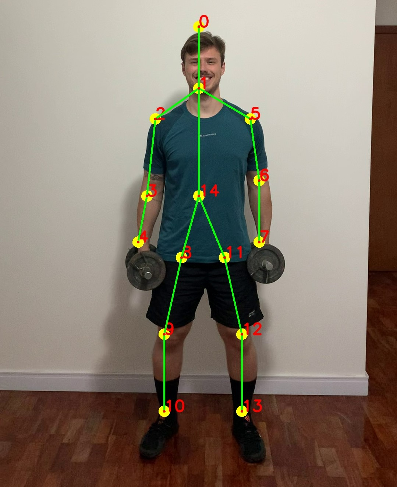

<p align="center">
  <a href="#blush-description">Description</a> •
  <a href="#book-tutorial">Tutorial</a> •
  <a href="#handshake-platform">Plataform</a> •  
  <a href="#desktop_computer-hardware">Hardware</a> •
  <a href="#weight_lifting-caffe-model">Caffe Model</a> •
  <a href="#art-about-me">About Me</a>
</p>

<h1 align="center">POSEXAU</h1>

<p align="center">Tool to Auxiliate Exercises Execution Pose did to my Final Paper in Computer Engineering.</p>
<h1 align="center">
    <a href="https://github.com/CMU-Perceptual-Computing-Lab/openpose">OpenPose</a>
</h1>
<h1 align="center">
    <a href="https://www.anaconda.com/">🐍 Anaconda</a>
</h1>
<p align="center">🚀 That was done in an Anaconda enviroment with python 3.7.11 using Jupyter Notebook IDE.</p>

<h4 align="center"> 
	🚧  Python Select 🚀 Building...  🚧
</h4>
<p align="center">

</p>

## :blush: **Description**

Put your personal vídeos practicing exercises and verify if you are doing correct.

## :book: **Tutorial**

Create the enviroment necessary to use that Tool.
```
conda create --name POSEXAU python=3.7.11
```

Activate the enviroment:
```
conda activate POSEXAU
```

Install packages dependencies:
```
conda install -c anaconda jupyter

conda install -c conda-forge opencv=4.5.3

conda install -c anaconda numpy=1.21.2

conda install -c jmcmurray os=0.1.4

pip install import-ipynb=0.1.3
```


## **Lateral Raise Exercise**

The first function of posexau is to inspection of shoulders exercise Lateral Raise, you can put a video in de input and verify if you are doing correct. 


```
posexau.inspec_lateral_raise(confs,prob_min_lateral_raise,frame, points, angle_max_arms, True)
```

That recive with parameters:

```
"confs" =  vetor with confiabilities.
"prob_min_lateral_raise" = minimal confiability choose for the user.
"frame" = frame for the video.
"points" = points of body positions in the frame.
"angle_max_arms" = minimal angle accept for the tool choose for the user to the arms in the exercise.
Flag to choose if the Tool draw the angles about the arms and chest in the frame.
```

## **Barbell Curl Exercise**

The first function of posexau is to inspection of biceps exercise Barbell Curl, you can put a video in de input and verify if you are doing correct. 


```
posexau.inspec_barbell_curl(confs,prob_min_barbell_curl,frame, points, angle_accepted_arms, False)
```

That recive with parameters:

```
"confs" =  vetor with confiabilities.
"prob_min_barbell_curl" = minimal confiability choose for the user.
"frame" = frame for the video.
"points" = points of body positions in the frame.
"angle_accepted_arms" = ponderation margin to accept in angle of hiperextension.
Flag to choose if the Tool draw the angles about the arms and chest in the frame.
```

## :handshake: **Platform**

The system is designed to work on both platforms, Windows and Linux. 

## :desktop_computer: **Hardware**
Since it's only inference and not training, a computer with a processing power of a fourth generation i5 processor and a camera of at least 7 Megapixels to record the videos.

## :weight_lifting: **Caffe Model**
The Caffe Model weights used can be dowloaded at
http://posefs1.perception.cs.cmu.edu/Users/tsimon/Projects/coco/data/models/mpi/pose_iter_160000.caffemodel
